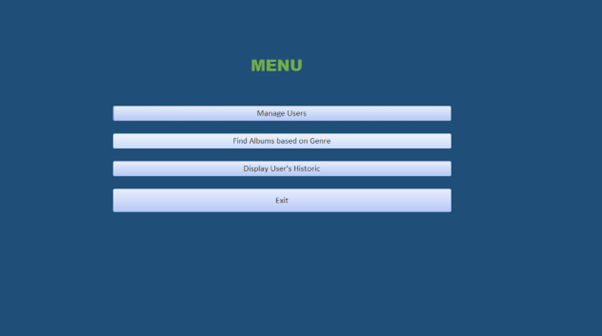
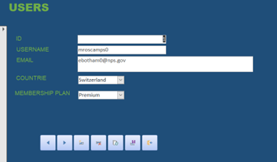

# Spotify-Streaming-Data
<h3>How does it work?</h3>

  •	Collaborated with 3 random members to make a database application with front-end Microsoft Access and back-end: MySQL Workbench and Oracle  
  •	Made the business rules after navigating the value of the product and following the normalization (NF) rules. Using Data Definition Language (DDL), we constructed essential elements such as hierarchies, 'is-a,' 'contains,' and 'related-to' relationships 
  •	Allowed users to efficiently store and manage intricate details concerning their interactions with the Spotify platform, encompassing songs, playlists, artists, and other relevant data 
  • Handled user INSERTS, UPDATES, and DELETES and recorded data changes with timestamps in Oracle, PL/SQL was implemented with a set of triggers. 
  • Made testing plans, code reviews, and generated test data to examine constraints and ensure triggers worked as required.

 
<h3 align="left">Data Model</h3>

  

 
<h3 align="left">With Access</h3>

  🚩 This is how the front-end look like. 
  

 

  

 
